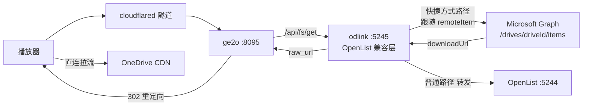

## 产品概述

让 Emby 播放真正走 302 直链（播放器直接向 OneDrive 拉流），而不是当前一律回退"中转"（视频流经 runner 代理）。

## 核心问题（用户已定性，本方案据此设计）

OneDrive 根目录下的 `0`–`5`、`backup`、`个人保管库` 全部是**快捷方式（remoteItem）**，指向 6 个不同的远程盘，媒体分布在其中多个（含 `3`，目标盘 `613c72e0…`）。Graph 对 `root:/3:/children` 直接拒绝；rclone 会自动跟随 `remoteItem` 所以挂载/扫描/回源全正常，OpenList 驱动不跟随所以子目录全部 `object not found`。

## 核心功能

1. 新增一个最小 OpenList 兼容直链服务：用 Graph API 复刻 rclone 的快捷方式跟随（解析 `remoteItem.parentReference.driveId` + `remoteItem.id`，切到 `/drives/{driveId}/items/{id}` 继续下钻），把目标文件的 `@microsoft.graph.downloadUrl` 作为直链返回给 ge2o，使其 302 生效。
2. 非快捷方式路径保持原行为：转发给本机 OpenList（5244）处理，做到无回归。
3. 修正"假健康"探活：现有 4 处探活只列根目录 `/onedrive`（快捷方式名能列出所以恒 200），改为探测真实媒体子目录，使链路不可用时诚实回退并告警。
4. 启动自检输出每个快捷方式的解析结果（目标盘、子目录能否列举、能否取到直链），全部脱敏后写入归档日志。

## 边界与约束

- 仓库公开、workflow 日志任何人可见：新增诊断输出必须脱敏（不输出 token、完整直链、Cookie）。
- runner 每轮全新环境，脚本需在 workflow 内生成/下载并后台启动，仅依赖 python3/jq/curl。
- 若目标租户策略禁用了 `@microsoft.graph.downloadUrl`，必须有明确探测结果与停止点，不盲目切换。

## 技术栈

- 语言：Python 3（标准库 `http.server` / `urllib` / `json`），与仓库既有脚本风格一致（`.github/scripts/` 下已有多个 python 脚本如 `speedtest.py`、`compute_video_stats.py`）
- 编排：GitHub Actions workflow（`.github/workflows/emby.yml`，纯 bash + curl + jq）
- 依赖：无新增第三方依赖；复用 runner 已有的 python3、jq、curl、rclone
- 认证来源：复用 `~/.config/rclone/rclone.conf` 的 `[onedrive]` 段（`client_id` / `client_secret` / `token.refresh_token`），与现有 OpenList 自动注册完全同源

## 实现思路

ge2o 只能通过 alist/OpenList 协议取直链，而 OpenList 官方 OneDrive 驱动**没有 `drive_id` 参数**、也不跟随 `remoteItem`（官方驱动仅有 refresh_token/client 系列、`site_id`+`is_sharepoint`、`root_folder_path`、chunk、自定义 host）。因此在 ge2o 与 Graph 之间插入一个"协议兼容层"：**对外伪装成 OpenList 的 `/api/fs/*` 接口，对内用 Graph 跟随快捷方式**，ge2o 仅需把 `openlist.host` 指向它，无需改动 ge2o。

ge2o 的接口契约（已读 `internal/service/openlist/api.go` 源码确认）：

- `POST /api/fs/get` body `{refresh:false,password:"",path}` → 取 `data.raw_url` 作为 302 目标（这是直链的关键）
- `POST /api/fs/list` body 同上 → 列目录（用于目录树/探测）
- `POST /api/fs/other` body `{method:"video_preview",...}` → 转码预览；当前 `video-preview.enable:false`，不实现，返回非 200 即可
- 请求头带 `Authorization: <token>`；要求 HTTP 200 且响应体 `code == 200`

路径解析算法（复刻 rclone）：

1. 从 `/me/drive/root` 开始，逐段下钻 `/drives/{curDrive}/items/{curId}:/{segment}`
2. 若返回 item 含 `remoteItem`，则切换 `curDrive = remoteItem.parentReference.driveId`、`curId = remoteItem.id`，继续下钻后续段
3. 命中文件后带 `?select=id,name,size,@microsoft.graph.downloadUrl` 取预授权直链（约 1 小时有效、支持 Range，是官方推荐直链）

分流策略（保证无回归）：路径第一段若命中已知快捷方式集合 → 走 Graph 跟随；否则原样转发到本机 OpenList `5244` 的同一接口并返回其响应。快捷方式集合由启动时对根目录做一次探测自动得出（不写死 `3`，自动覆盖 6 个远程盘）。

## 架构设计



- `odlink` 为无状态短进程（每轮 run 内常驻），仅做协议转换与路径解析
- 直链有效期约 1 小时，因此在进程内做 `path -> (downloadUrl, expire)` 内存缓存，同一 run 内重复播放直接命中，避免重复 Graph 往返
- access_token 在进程内缓存，临近过期自动用 refresh_token 刷新

## 实现要点（执行细节）

- **先探测后切换**：第一步只加只读探测，跑一轮确认三件事——根目录各项确为 remoteItem、跟随后能否列出子目录、目标文件能否返回 `downloadUrl`。任一项不成立则停止，退化为明确结论。
- **探测目标自动派生**：不写死 `3`，复用 workflow 里既有的 Emby guard SQL（`Path like '/onedrive/%'`）派生媒体顶层目录集合，自动覆盖 0–5/backup。
- **探活口径修正**（4 处：`install openlist` 注册校验、`run cloudflared` 启动探活、watchdog 每 60s、`backup emby data` 回传前校验）：从 `fs/list /onedrive` 改为对真实媒体子目录做 `fs/list`；失败时按现有逻辑回退 direct 并推送告警。这是"302 看着健康却从不生效"的直接原因。
- **脱敏**：新增日志一律过滤 token、完整直链（仅保留 `https://<host>/...` 形式或 `[redacted]`）、请求头与 Cookie，沿用现有 `redact()` 规则（`api_key=`、`X-Emby-Token=` → `[redacted]`，URL → `<url>`，整行丢弃 ge2o 的 `headers to encode cacheKey` 行）。
- **失败可观测**：odlink 每个请求的结果（路径段数、是否跨 drive、Graph HTTP 码、是否取到直链）写入 `/opt/logs/odlink.log`，收尾步骤 `tail` 进 workflow 日志；Graph 报错只记录状态码与错误码串，不记录响应体全文。
- **性能**：路径逐段解析会产生 N 次 Graph 往返，加"目录段 → (driveId, itemId)"内存缓存后，同目录连续播放仅 1 次往返；watchdog 每 60s 探活 1 次，开销可忽略。
- **零回归保障**：`EMBY_PLAYBACK_MODE` 与 direct 回退链路保持现状；odlink 不可用时探活失败 → 自动回退 direct，行为与今天一致。

## 目录结构

```
.github/
├── scripts/
│   └── emby302/
│       ├── odlink.py        # [NEW] OpenList 兼容直链服务。实现 POST /api/fs/get、/api/fs/list、/api/fs/other；
│       │                    #        用 Graph 逐段解析路径并跟随 remoteItem 跨 drive；取 @microsoft.graph.downloadUrl
│       │                    #        作为 raw_url；非快捷方式路径原样转发到本机 OpenList :5244；
│       │                    #        进程内缓存 access_token / 目录段映射 / 直链；校验 Authorization 头；
│       │                    #        结构化日志写入 /opt/logs/odlink.log（全部脱敏）
│       └── od_probe.sh      # [NEW] 启动自检与探测脚本。用 rclone.conf 凭据换 token，遍历根目录下各条目判断
│                            #        是否 remoteItem、打印目标 driveId（脱敏前 8 位）、跟随后能否列出子目录、
│                            #        样例文件能否返回 downloadUrl；结果作为是否切换 302 的判据
└── workflows/
    └── emby.yml             # [MODIFY]
                             #  1) install openlist 步骤后新增「start odlink」：从 rclone.conf 提取凭据写配置，
                             #     后台启动 odlink（:5245），生成 /opt/odlink-token
                             #  2) install ge2o 步骤：config.yml 的 openlist.host 改为 http://127.0.0.1:5245，
                             #     openlist.token 改用 odlink token
                             #  3) 4 处探活 fs/list 的目标由根目录 /onedrive 改为真实媒体子目录
                             #  4) run cloudflared 启动自检里调用 od_probe.sh 并输出脱敏结果
                             #  5) send telegram notification 步骤追加归档 /opt/logs/odlink.log（tail，脱敏）
```

## 关键代码结构

```python
# odlink.py 核心：路径解析（跟随快捷方式），返回目标 item
def resolve(path_segments: list[str]) -> dict:
    """从 /me/drive/root 起逐段下钻；遇 remoteItem 则切换到目标 drive 继续。
    返回 Graph driveItem JSON；未命中抛LookupError。"""

# OpenList 兼容响应（ge2o 读取 data.raw_url）
# {"code": 200, "message": "success",
#  "data": {"name": str, "size": int, "is_dir": bool, "raw_url": str}}
```